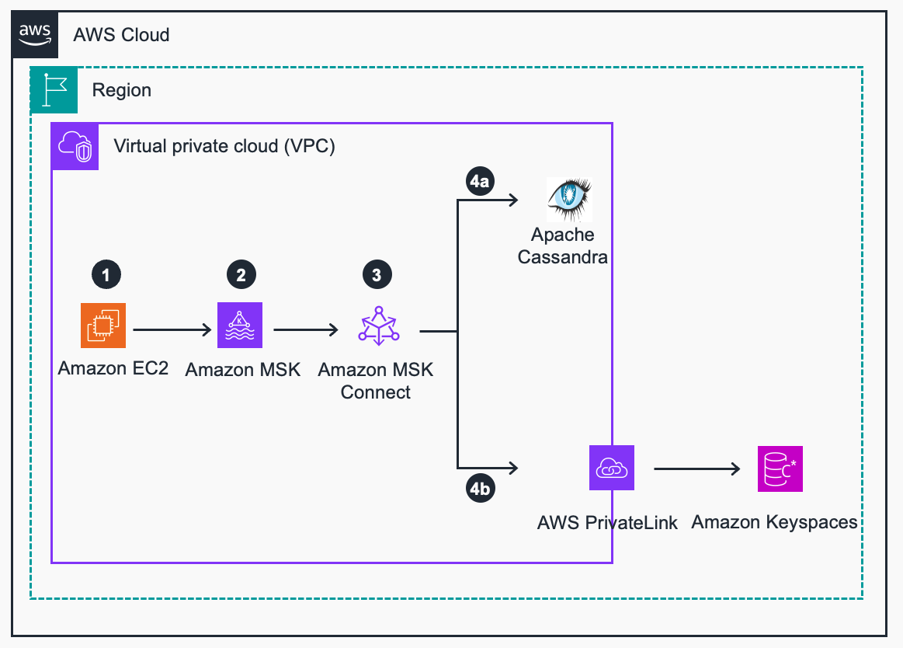
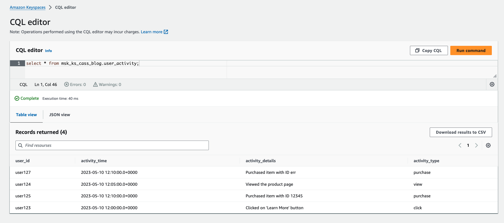
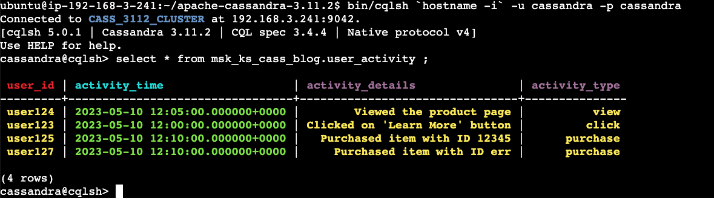

# Guidance for Apache Cassandra migration to Amazon Keyspaces using Amazon MSK dual writes


## Table of Content

1. [Overview](#overview)
    - [Cost](#cost)
2. [Prerequisites](#prerequisites)
    - [Operating System](#operating-system)
    - [AWS account requirements](#AWS-account-requirements)
    - [Supported Regions](#Supported-Regions)
3. [Deployment Steps](#deployment-steps)
4. [Deployment Validation](#deployment-validation)
5. [Running the Guidance](#running-the-guidance)
6. [Next Steps](#next-steps)
7. [Cleanup](#cleanup)

***Optional***

8. [FAQ, known issues, additional considerations, and limitations](#faq-known-issues-additional-considerations-and-limitations-optional)
9. [Revisions](#revisions-optional)
10. [Notices](#notices-optional)
11. [Authors](#authors-optional)

## Overview

This Guidance demonstrates how to efficiently implement dual writes to Apache Cassandra and Amazon Keyspaces using Amazon Managed Streaming for Kafka (MSK) during data migrations, ensuring zero downtime and smooth migration. It facilitates the continuous flow of new data changes to both the source Cassandra cluster and the target Keyspaces simultaneously, while historical data is migrated in the background. This dual-write capability facilitated by Amazon MSK ensures that all recent writes are mirrored in both databases, preparing the systems for a seamless cutover. Once the historical migration completes, businesses can switch to Keyspaces without any downtime, thereby maintaining uninterrupted access to data and operations. Included sample code features CloudFormation templates that significantly reduce the complexity of setting up key components such as Amazon MSK Cluster, VPC, Amazon Keyspaces and Cassandra cluster, reducing manual configuration efforts. These templates, along with additional scripts for Kafka sink connectors, allows you to simultaneously insert data into Amazon Keyspaces and Apache Cassandra databases. 

Architecture diagram:



2. Include the architecture diagram image, as well as the steps explaining the high-level overview and flow of the architecture. 
    - To add a screenshot, create an ‘assets/images’ folder in your repository and upload your screenshot to it. Then, using the relative file path, add it to your README. 

### Cost

You are responsible for the cost of the AWS services used while running this Guidance.

As of 07/02/2024, the cost for running this guidance with the default settings in the US East (N. Virginia) is approximately $690.64 per month for producing 1 million messages and inserting them in to Amazon Keyspaces and Apache Cassandra databases.


The following table provides a sample cost breakdown for deploying this Guidance with the default parameters in the US East (N. Virginia) Region for one month.

| AWS service  | Dimensions | Monthly Cost [USD] |
| ----------- | ------------ | ------------ |
| Amazon Managed Streaming for Apache Kafka (MSK) | Storage per Broker (100 GB), DT Intra-Region: (1 GB per month), Number of Kafka broker nodes (3), Compute Family (t3.small), Number of MCUs (2)  | $ 290.484 |
| Amazon EC2 (kafka client instance) | Tenancy (Shared Instances), Operating system (Linux), Workload (Consistent, Number of instances: 1), Advance EC2 instance (t2.medium), Pricing strategy (EC2 Instance Savings Plans 3yr  No Upfront), EBS Storage amount (100 GB) | $ 22.6 |
| Amazon EC2 (cassandra nodes) | Tenancy (Shared Instances), Operating system (Linux), Workload (Consistent, Number of instances: 3), Advance EC2 instance (t2.2xlarge), Pricing strategy (EC2 Instance Savings Plans 3yr  No Upfront), EBS Storage amount (100 GB)  | $ 375.276 |
| Amazon Keyspaces | LOCAL_QUORUM reads (1000000 per month), PITR Storage (Enabled), Storage (1 GB), Number of writes (1000000 per month)| $ 2.28 |

We recommend creating a [Budget](https://docs.aws.amazon.com/cost-management/latest/userguide/budgets-managing-costs.html) through [AWS Cost Explorer](https://aws.amazon.com/aws-cost-management/aws-cost-explorer/) to help manage costs. Prices are subject to change. For full details, refer to the pricing webpage for each AWS service used in this Guidance.

## Prerequisites
- The [AWS CLI](https://docs.aws.amazon.com/cli/latest/userguide/getting-started-install.html) installed.
- Access to deploy Cloudformation template and create resources (Amazon MSK, Amazon Keyspaces, EC2, VPC, Subnets, Security groups, IAM roles and Policies)
- Clone Repository

### Operating System

- Mac or Linux or Amazon Linux environment can be used to run or deploy this Guidance.

### AWS account requirements

This deployment requires that you have access to the following AWS services:

- Amazon S3 
- Amazon Managed Streaming for Apache Kafka (MSK)
- Amazon Keyspaces
- EC2
- VPC
- IAM


### Supported Regions

This guidance can be deployed in any AWS Regions where Amazon Keyspaces is supported. You can find list of Amazon Keyspaces Service Endpoints for each AWS region from here [link] (https://docs.aws.amazon.com/general/latest/gr/keyspaces.html)


## Deployment Steps

These deployment instructions are optimized to best work on Mac or Amazon Linux 2023. Deployment in another OS may require additional steps.
 

1. Clone the repo using command 
```

git clone https://github.com/aws-solutions-library-samples/guidance-for-dual-writes-migration-from-cassandra-to-keyspaces-using-amazon-kafka-msk-on-aws
```
2. cd to the repo templates folder 
```

cd guidance-for-dual-writes-migration-from-cassandra-to-keyspaces-using-amazon-kafka-msk-on-aws/deployment/templates
```
3. Configure AWS CLI environment by setting below values. Make sure to replace the place holders with your environment specific values
```
export AWS_REGION=<AWS Region>
export AWS_ACCOUNT_ID=<AWS Account ID>
export AWS_ACCESS_KEY_ID=<AWS ACCESS KEY>
export AWS_SECRET_ACCESS_KEY=<AWS SECRET ACCESS KEY>
```
4. Run below command to create S3 bucket to place Kafka Cassandra Sink plugin
 ```

aws s3api create-bucket --bucket msk-ks-cass-$AWS_ACCOUNT_ID
```
5. Now create EC2 Key pair with name "msk-ks-cass-kp" and download the key pair for future use
6. Now run below command to deploy cloudformation template to create new VPC, Subnets, Security groups, Amazon MSK Cluster, Kafka Client EC2 instance, Amazon Keyspaces VPC endpoint, Amazon Keyspaces Keyspace and table, Amazon MSK custom plugin, Kafka topic and IAM roles with policies. Please note that MSK cluster creation will take some time, Don't cancel or stop the command in middle.You can check progress from Cloudformation console.
```
aws cloudformation deploy --template-file cfn-msk-ks-cass.yml --stack-name msk-ks-stack --parameter-overrides KeyName=msk-ks-cass-kp --tags purpose=msk-keyspaces-creation --s3-bucket msk-ks-cass-$AWS_ACCOUNT_ID  --capabilities CAPABILITY_NAMED_IAM
```
7. Once Cloudformation stack "msk-ks-stack" is finished, then run below command to capture output of stack into a file.
```
aws cloudformation describe-stacks --stack-name msk-ks-stack --query "Stacks[0].Outputs[*].[OutputKey,OutputValue]" --output text > stack_resources_output
```
8. Now pick values of "MSKCassandraVPCId", "PrivateSubnetOne", "PrivateSubnetTwo", "PrivateSubnetThree" and "KafkaClientInstanceSecurityGroupID" from output file "stack_resources_output"
9. Now pass value of "MSKCassandraVPCId" to VpcId, "PrivateSubnetOne" to Subnet1, "PrivateSubnetTwo" to Subnet2, "PrivateSubnetThree" to Subnet3 and "KafkaClientInstanceSecurityGroupID" to SourceSecurityGroup and CassandraClientSecurityGroup and deploy the cloudformation template to create Cassandra nodes.

Note: if you want to use separate EC2 instances for Kafka client and Cassandra SSH instance, then make sure to pass security group id of your Cassandra client instance to CassandraClientSecurityGroup instead of using same security group of Kafka Client Instance

```
aws cloudformation deploy --template-file cfn_cassandra_cluster_creation.yml --stack-name cass-cluster-stack --parameter-overrides KeyName=msk-ks-cass-kp VpcId=<value of MSKCassandraVPCId> Subnet1=<value of PrivateSubnetOne> Subnet2=<value of PrivateSubnetTwo> Subnet3=<value of PrivateSubnetThree> SourceSecurityGroup=<value of KafkaClientInstanceSecurityGroupID> CassandraClientSecurityGroup=<value of KafkaClientInstanceSecurityGroupID> --tags purpose=msk-cass-nodes-creation --capabilities CAPABILITY_NAMED_IAM
```
10. Once Cloudformation stack "cass-cluster-stack" is finished, then run below command to capture output of stack into a file.

```
aws cloudformation describe-stacks --stack-name cass-cluster-stack --query "Stacks[0].Outputs[*].[OutputKey,OutputValue]" --output text > stack_resources_cassandra_output
```


## Deployment Validation

Open CloudFormation console and verify the status of the templates with the names "msk-ks-stack" and "cass-cluster-stack". If deployments are successful you should be able to see Amazon MSK Cluster, Amazon Keyspaces VPC endpoint, Amazon EC2 Kafka client instance, Three Amazon EC2 Cassandra nodes, Amazon MSK Custom plugin, Amazon Keyspaces Keyspace and a table.


## Running the Guidance

Once the CloudFormation stack is deployed, Follow the below steps to configure and test the guidance.

1. Populate Keyspaces connector input json file with resources created from deployment

```
cd guidance-for-dual-writes-migration-from-cassandra-to-keyspaces-using-amazon-kafka-msk-on-aws/deployment/templates
sh update_param_keyspaces.sh
```

2. Generate Amazon Keyspaces service specific credentials for IAM user "ks-user" that was created as part of "msk-ks-stack" deployment

3. Update "auth.username" and "auth.password" values in "msk-keyspaces-connector.json" file with Keyspaces service specific credentials

4. Now Create Amazon MSK connector for Amazon Keyspaces by running below command

```
aws kafkaconnect create-connector --cli-input-json file://msk-keyspaces-connector.json
```
5. Now finish configuring Cassandra cluster, starting with Cassandra node One.Connect to Cassandra Kafka client EC2 instance “msk-ks-cass-KafkaClientInstance” using EC2 Instance Connect and ssh to “CassandraNode-One” using EC2 key-pair msk-ks-cass-kp.pem, start cassandra and check Cassandra nodetool status. Make sure to replace "<IP Address of CassandraNode-one>" with IP address of Cassandra Node one. Status of cluster should show One cassandra node.

```
ssh -i "msk-ks-cass-test-kp.pem" ubuntu@<IP Address of CassandraNode-one>
cd /home/ubuntu/apache-cassandra-3.11.2
bin/cassandra
bin/nodetool status
```

6. Stay on Cassandra node one commandline and Check CQLSH connectivity on Cassandra Node one

```
cd /home/ubuntu/apache-cassandra-3.11.2
bin/cqlsh `hostname -i` -u cassandra -p cassandra

select * from system.local
```

7. Stay on commandline and get IP Address of "CassandraNode-One" with below command to use it in other two nodes for Cassandra cluster setup

```

hostname -i
```

8. Now configure second Cassandra node by doing ssh to “CassandraNode-Two” using EC2 key-pair msk-ks-cass-kp.pem. Edit "cassandra.yaml" and update value of "seeds" property with IP Address of CassandraNode-One from step-7 and save the file, start Cassandra and check status of cluster. Status of cluster should show two cassandra nodes now.

```
ssh -i "msk-ks-cass-test-kp.pem" ubuntu@<IP Address of CassandraNode-Two>
cd /home/ubuntu/apache-cassandra-3.11.2
vi conf/cassandra.yaml

bin/cassandra
bin/nodetool status
```

9. Now configure Third Cassandra node by doing ssh to “CassandraNode-Three” using EC2 key-pair msk-ks-cass-kp.pem. Edit "cassandra.yaml" and update value of "seeds" property with IP Address of CassandraNode-One from step-7 and save the file. Status of cluster should show Three cassandra nodes now.

```
ssh -i "msk-ks-cass-test-kp.pem" ubuntu@<IP Address of CassandraNode-Three>
cd /home/ubuntu/apache-cassandra-3.11.2
vi conf/cassandra.yaml

bin/cassandra
bin/nodetool status
``` 

10. Stay on “CassandraNode-Three” commandline and create keyspace and table.

```

cd /home/ubuntu/apache-cassandra-3.11.2

bin/cqlsh `hostname -i` -u cassandra -p cassandra

CREATE KEYSPACE msk_ks_cass_blog WITH replication = {'class': 'NetworkTopologyStrategy', 'Datacenter1': '3'}  AND durable_writes = true;

CREATE TABLE msk_ks_cass_blog.user_activity (
    user_id text,
    activity_time timestamp,
    activity_details text,
    activity_type text,
    PRIMARY KEY (user_id, activity_time)
) WITH CLUSTERING ORDER BY (activity_time DESC);

```

11. Now exit from Cassandra node and Kafka client EC2 instance and go back to commandline where you downloaded the repo to configure input json file for Amazon MSK Cassandra connector.

```
cd guidance-for-dual-writes-migration-from-cassandra-to-keyspaces-using-amazon-kafka-msk-on-aws/deployment/templates
sh update_param_cassandra.sh
```

12. Now update cassandra cluster IP address in “msk-cassandra-connector.json” file. Set value of "datastax-java-driver.basic.contact-points" property to “CassandraNode-One” IP Address and save it

```

vi msk-cassandra-connector.json
"datastax-java-driver.basic.contact-points": “<CassandraNode-One IP Address>:9042"
```

13. Now create Amazon MSK connector for Cassandra database by using below command.

```

aws kafkaconnect create-connector --cli-input-json file://msk-cassandra-connector.json
```

14. Now you have Amazon MSK cluster with two MSK connect connectors (one for Apache Cassandra and another one for Amazon keyspaces) ready to make dual writes. Connect to commandline of Kafka client EC2 instance “msk-ks-cass-KafkaClientInstance” using EC2 Instance connect and set below environment variables.

```

export WORKING_DIR=/home/ec2-user
export REGION=$(curl --silent http://169.254.169.254/latest/dynamic/instance-identity/document | jq -r .region)
export AWS_ACCOUNT_ID=$(aws sts get-caller-identity --query Account --output text)
export msk_arn=$(aws kafka list-clusters | grep "ClusterArn" | awk -F\" '{print $4}')
export msk_bootserv=$(aws kafka get-bootstrap-brokers --cluster-arn $msk_arn | grep -o '"BootstrapBrokerStringSaslIam": "[^"]*"'|awk -F\" '{print $4}')
```

15. Now connect to kafka producer, generate and publish messages to Kafka topic "mskkscassdualwrites". Amazon MSK connect feature of Amazon Managed Streaming for Kafka (Amazon MSK), ingests the data from kafka topic “mskkscassdualwrites” to Apache Cassandra and Amazon Keyspaces based on the connector configurations.

```

$WORKING_DIR/kafka/kafka_2.13-3.5.1/bin/kafka-console-producer.sh --broker-list $msk_bootserv --producer.config $WORKING_DIR/kafka/kafka_2.13-3.5.1/bin/client.properties --topic mskkscassdualwrites

Now paste below messages one after another and hit enter after each message

{"user_id": "user123", "activity_time": "2023-05-10T12:00:00Z", "activity_type": "click", "activity_details": "Clicked on 'Learn More' button"}
{"user_id": "user124", "activity_time": "2023-05-10T12:05:00Z", "activity_type": "view", "activity_details": "Viewed the product page"}
{"user_id": "user125", "activity_time": "2023-05-10T12:10:00Z", "activity_type": "purchase", "activity_details": "Purchased item with ID 12345"}
{"user_id": "user127", "activity_time": "2023-05-10T12:10:00Z", "activity_type": "purchase", "activity_details": "Purchased item with ID err"}
```

16. Now you should see all four records in Amazon Keyspaces and Cassandra databases. Start validating records in Amazon Keyspaces by connecting to CQL editor from AWS Console, you should see 4 records in table "msk_ks_cass_blog.user_activity" like below screen shot.

Amazon Keyspaces CQL Editor:



17. Now validate data in Apache Cassandra Database table "msk_ks_cass_blog.user_activity" by connecting to CQLSH from any one of Cassandra nodes by doing SSH from Kafka client EC2 instance “msk-ks-cass-KafkaClientInstance”.

```
ssh -i "msk-ks-cass-test-kp.pem" ubuntu@<IP Address of CassandraNode-One>

cd /home/ubuntu/apache-cassandra-3.11.2

bin/cqlsh `hostname -i` -u cassandra -p cassandra

select * from msk_ks_cass_blog.user_activity ;
```

Apache Cassandra CQLSH output screenshot:




## Next Steps

Having explored how to efficiently implement dual writes to Apache Cassandra and Amazon Keyspaces using Amazon Managed Streaming for Kafka (MSK) during data migrations, You can implement similar setup for your Applications during migration from Apache Cassandra to Amazon Keyspaces. Your Applications can write data to Amazon Managed Streaming for Kafka (MSK) and MSK will send new writes to both Cassandra and Keyspaces while you backfill the historical data from Cassandra to Keyspaces.


## Cleanup

To delete resources created as part of this guidance, you can finish below steps

1. Delete all resources created using below command. Check cloudformation stacks (cass-cluster-stack and msk-ks-stack) deletion status from cloudformation from AWS console. If VPC created as part of "msk-ks-stack" not deleted as part of below command, then run command in step 2.

```

cd guidance-for-dual-writes-migration-from-cassandra-to-keyspaces-using-amazon-kafka-msk-on-aws
sh delete_stack.sh
```

2. This step is optional and needed when VPC and subnets created as part of "msk-ks-stack" not deleted during cloudformartion stack deletion.

```

cd guidance-for-dual-writes-migration-from-cassandra-to-keyspaces-using-amazon-kafka-msk-on-aws
sh delete_vpc.sh
```

3. Make sure to check for any left over resources and delete them manually to avoid any accidental charges

## Notices


Customers are responsible for making their own independent assessment of the information in this Guidance. This Guidance: (a) is for informational purposes only, (b) represents AWS current product offerings and practices, which are subject to change without notice, and (c) does not create any commitments or assurances from AWS and its affiliates, suppliers or licensors. AWS products or services are provided “as is” without warranties, representations, or conditions of any kind, whether express or implied. AWS responsibilities and liabilities to its customers are controlled by AWS agreements, and this Guidance is not part of, nor does it modify, any agreement between AWS and its customers.*


